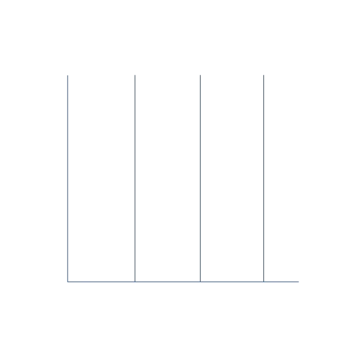

<span>
  
  <a href="https://github.com/McMaldo" color="transparent">
    
  </a>
  <a href="https://gitlab.com/maldonado.ignacio.pablo" color="transparent">
    
  </a>
  <a href="mailto:ignacio.pablo.maldonado@gmail.com" color="transparent">
    
  </a>
  <a href="https://www.linkedin.com/in/pablo-ignacio-maldonado" color="transparent">
    
  </a>
</span>

<h2> Dev Tools</h2>

<table>
  <tr>
    <th width=25% align="center">Front-end</th>
    <th width=25% align="center">Back-end</th>
    <th width=25% align="center">Data Base</th>
    <th width=25% align="center">General</th>
  </tr>
  <tr>
    <td align="center">
      
      
      
      
      
      
      
      
      
      
      
    </td>
    <td align="center">
      
      
      
      
      
      
      
      
      
    </td>
    <td align="center">
      
      
    </td>
    <td align="center">
      
      
      
      
      
      
      
      
      
      
      
      
    </td>
  </tr>
</table>

<h2> GitHub Stats</h2>
<p align="center">
  <!--- stats (start) -->
  <table>
    <tr>
      <td width=60%>
        
        <!-- "https://git.io/streak-stats" -->
        
      </td>
      <td>
        
      </td>
    </tr>
  </table>
  <!--- stats (end) -->
  
  <!--- trophy (start) -->
  <div>
    <!-- https://github.com/ryo-ma/github-profile-trophy -->
    
  </div>
  <!--- trophy (end) -->
</p>

<h2> About Me</h2>

```js
// Hardcode Data, keep for testing only
let aboutMe = {
  name: { nick: "McMaldo", real: "Maldonado Pablo Ignacio" },
  origin: { country: "Argentina", year: 2005 },
  stat: { girlfriend: false, otaku: true },
  details: [
    "Really interested in the Web Development",
    "Currently studying at a technical highschool",
    "Preparing to obtain my First Certificate of English"
  ]
};
```

<!-- https://github.com/vibrantfix#gh-dark-mode-only -->
